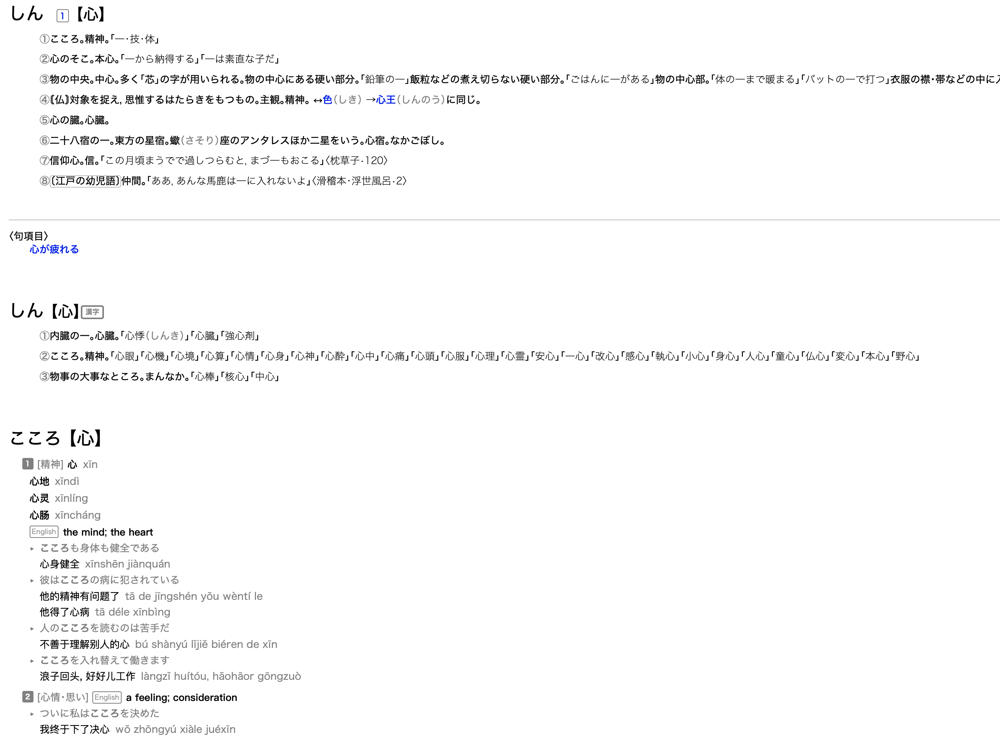

# Reverse-engineering Apple's JP, JP-EN and JP-CN Dictionaries

## Why?

I want to learn Japanese vocabulary and I've heard good things about Anki. However, manually editing the cards is a pain. I want a script that takes a word as the input and generate a card with detailed definitions for me and add the card to the deck (the latter can be achieved via [anki-connect](https://github.com/FooSoft/anki-connect)). Parsing definition webpages from e.g. [goo dictionary](dictionary.goo.ne.jp), which are highly unstructured, proved difficult, and thanks to [Fabian's blog post](https://fmentzer.github.io/posts/2020/dictionary/), I actually found it is easier to reverse-engineer Apple's dictionaries, which are also a more authorative source.

## Prerequisites

- python 3.9.5 with lxml 4.6.3
- rustc (cargo) 1.52.1 (can be installed from https://rustup.rs/)

Haven't tested with lower versions, but you can try.

## Build

Prefer building on Linux. The **lxml** library on MacOS may fail for no reason.

1. Extract raw dictionary data (in `raw/`) into json, stored in `extract/`.

   ```
   mkdir extract && python extract.py
   ```

2. Convert json into the bincode format, by which Rust programs can decode efficiently

   ```
   cd conv
   cargo run
   cd ..
   ```

3. Build the python module

   ```
   cd pyjisho
   cargo build --release
   cd ..
   ```

4. Copy or link the dynamic library to the directory where Python can `import jisho`

   ```
   ln -s jisho/target/release/libjisho.so jisho.so
   # libjisho.dylib on MacOS
   ```

5. Now you can `import jisho`, or `import pyjisho`, which is a higher-level wrapper. See `test.py` for example usage and run `python test.py` to check example output.

## Sample Output

See `out/result.html`, which should be the result of running `python test.py`



The styles do not look exactly the same in all browsers, because CSS attributes that are specific to Apple systems are extensively used.

With regard to the font, on macOS the native fonts will be used. On other systems where these fonts are not available, the fallback font is Noto Sans CJK JP, a high quality open-source font that can be installed from [here](https://www.google.com/get/noto/#sans-jpan).

# TODO

- building on macOS
  - why does lxml randomly crash?
- rewrite in Rust
  - why does flate2's zlib decoder behave differently from Python's?
  - what crate is comparable to lxml?
